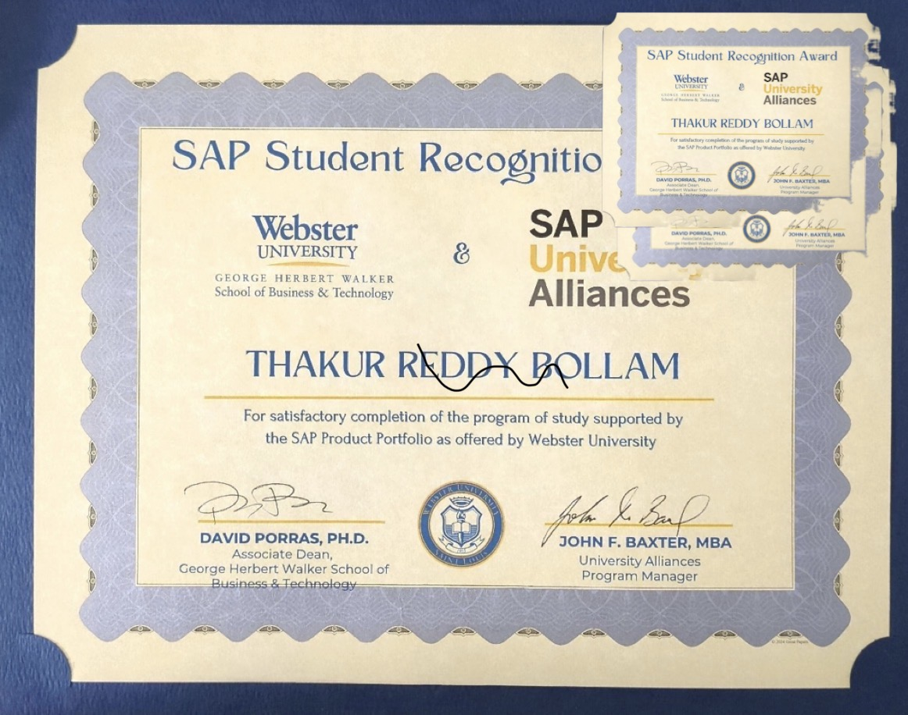

<h1 align="center">
  
</h1>

  
  

### 💼 My Expertise

**Business Analysis**
- Requirements Analysis
- Process Optimization
- Stakeholder Management

**Data Science**
- Machine Learning
- Deep Learning
- Predictive Analytics

**Data Engineering**
- ETL Pipelines
- Data Warehousing
- Big Data Processing

**Domain Specialization**
- Agriculture Technology
- Precision Farming
- Crop Analytics

🎯 **Current Focus**: Leveraging AI/ML for Agricultural Innovation

## 💻 Tech Stack

### Languages

### Data Science & ML

### Databases

### Cloud & DevOps

### Tools & Platforms

## 🌟 Featured Projects

## 📊 GitHub Stats

  

## 🏆 GitHub Trophies

  

## 🎬 My Skillset in Motion

  

---
## 💡 Random Dev Quote

### 💭 "Data is the new oil, and I'm here to utilize it!"

---
