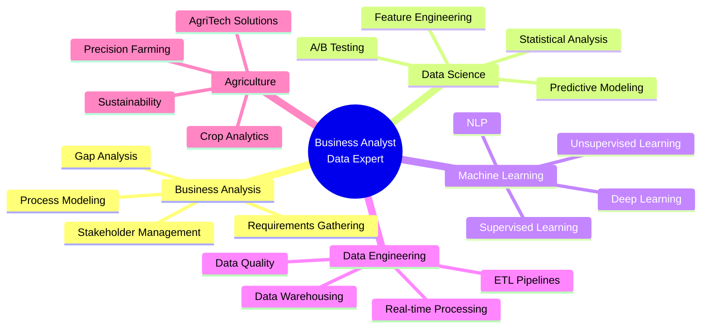

<h1 align="center">
  
</h1>

<p align="center">
  
  
</p>

## 🚀 About Me

👋 **Business Analyst & Data Scientist**

I'm passionate about transforming data into actionable insights and bridging the gap between business needs and technical solutions.

### 💼 My Expertise

**Business Analysis**
- Requirements Analysis
- Process Optimization
- Stakeholder Management

**Data Science**
- Machine Learning
- Deep Learning
- Predictive Analytics

**Data Engineering**
- ETL Pipelines
- Data Warehousing
- Big Data Processing

**Domain Specialization**
- Agriculture Technology
- Precision Farming
- Crop Analytics

🎯 **Current Focus**: Leveraging AI/ML for Agricultural Innovation

💬 Thanks for dropping by! Let's connect and build something amazing together!

## 🎯 What I Do

<div align="center">
  
</div>

- 📊 **Business Analysis**: Bridging the gap between business needs and technical solutions
- 🤖 **Machine Learning**: Building predictive models for data-driven decision making
- 🔧 **Data Engineering**: Creating robust data pipelines and infrastructure
- 🌾 **AgriTech**: Applying data science to revolutionize agriculture and farming practices

## 💻 Tech Stack

### Languages


### Data Science & ML


### Data Engineering & Big Data


### Databases


### Cloud & DevOps


### Business Intelligence & Visualization


### Tools & Platforms


## 🌾 Agriculture + Technology

<div align="center">
  
</div>

Passionate about applying cutting-edge technology to solve agricultural challenges:
- 🌱 Crop yield prediction using ML models
- 🛰️ Satellite imagery analysis for precision agriculture
- 💧 Smart irrigation systems with IoT and data analytics
- 📈 Market price forecasting for agricultural commodities
- 🔬 Soil health monitoring and recommendation systems

## 📊 GitHub Stats

<div align="center">
  
  
</div>

<div align="center">
  
</div>

<div align="center">
  
</div>

## 🏆 GitHub Trophies

<div align="center">
  
</div>

## 📈 Areas of Expertise



## 🎬 My Skillset in Motion

<div align="center">
  
</div>

### 📊 Business Intelligence Flow
```
Data Collection → Cleaning & Transformation → Analysis → Visualization → Insights → Action
     ↓                    ↓                      ↓            ↓            ↓         ↓
  [Surveys]          [Python/SQL]           [Statistics]  [Power BI]  [Reports]  [Strategy]
```

### 🤖 ML Pipeline
```
Problem Definition → Data Acquisition → EDA → Feature Engineering → Model Training → Evaluation → Deployment
        ↓                  ↓             ↓           ↓                    ↓             ↓           ↓
   [Business Need]    [APIs/DBs]    [Pandas]   [Scikit-Learn]      [TensorFlow]    [Metrics]   [Cloud]
```

### 🔄 Data Engineering Workflow
```
Source Systems → Ingestion → Storage → Processing → Serving → Consumption
      ↓             ↓          ↓          ↓          ↓           ↓
   [APIs/DBs]    [Kafka]   [S3/HDFS]   [Spark]   [Data Lake] [BI Tools]
```

## 🌟 Featured Projects

<div align="center">

[](https://github.com/nageshwar8296-bit/crop-yield-prediction)
[](https://github.com/nageshwar8296-bit/customer-segmentation)

</div>

## 📫 Let's Connect

<div align="center">

[](https://linkedin.com/in/YOUR_LINKEDIN)
[](https://twitter.com/YOUR_TWITTER)
[](mailto:your.email@example.com)
[](https://yourportfolio.com)
[](https://medium.com/@YOUR_MEDIUM)

</div>

## 💡 Random Dev Quote

<div align="center">


</div>

## 🐍 Contribution Snake

<div align="center">
  
</div>

---

<div align="center">
  

  ### 💭 "Data is the new oil, and I'm here to utilize it!"

  

</div>
